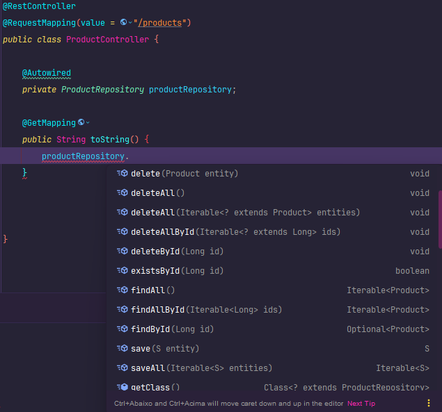
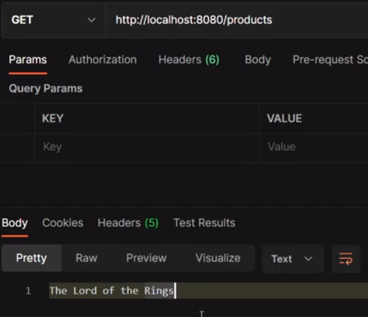
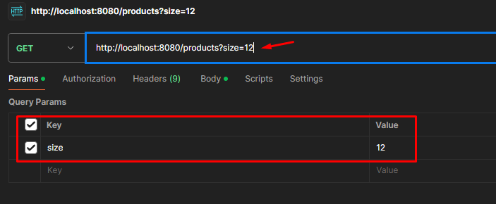
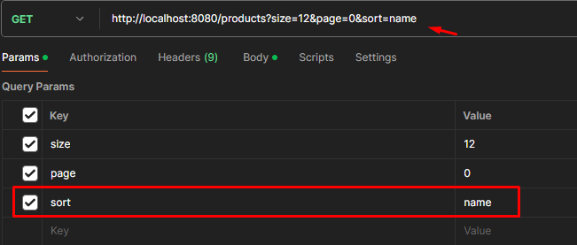
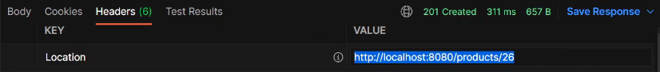
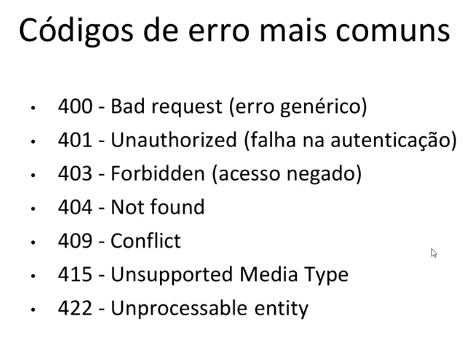
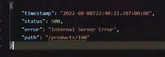
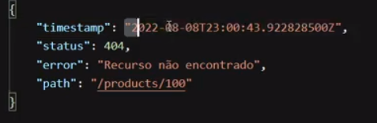
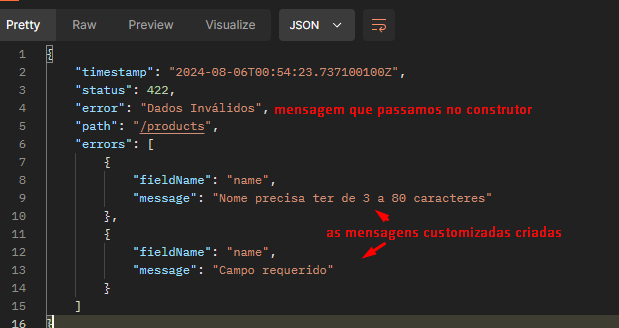

<p align="center">
  
</p>


# Tópicos

* [Objetivo](#objetivo)
* [Requisitos projeto](#requisitos-projeto)
* [Diagrama UML](#uml)


* [API REST - Conceitos](#api-rest---conceitos)
  * [API WEB](#api-web)
  * [API REST](#api-rest)
    * [Padrão REST - Regras](#padrão-rest---regras)


* [Recursos, URL, parâmetros de consulta e de rota](#recursos-url-parâmetros-de-consulta-e-de-rota)
* [Padrões de URL, verbos HTTP, códigos de resposta](#padrões-de-url-verbos-http-códigos-de-resposta)
* [Verbos HTTP mais utilizados](#verbos-http-mais-utilizados)
* [Códigos de resposta HTTP](#códigos-de-resposta-http)


* [Padrão camadas (controller, service, acesso a dado)](#padrão-camadas-controller-serviço-acesso-a-dados)
* [Responsabilidades das camadas](#responsabilidades-das-camadas)


* [Primeiro teste da API REST](#primeiro-teste-da-api-rest)


* [Controller](#controller)
* [Repository](#primeiro-teste-com-repository)
* [Service](#criação-service)


* [Criando DTO e estruturando camadas](#criando-dto-e-estruturando-camadas)
* [Primeiro, vamos entender uma coisa, o que seria DTO?](#primeiro-vamos-entender-uma-coisa-o-que-seria-dto)
* [Pra quê usar DTO?](#pra-quê-usar-dto)
* [Como copiar dados da entity para o DTO?](#como-copiar-dados-da-entity-para-o-dto)


* [CRUD](#crud)
* [findById](#findbyid)
* [findAll](#findall---busca-paginada-de-produtos)
  * [findAll - Busca paginada (Pageable)](#ok-e-para-realizar-a-busca-paginada-usaremos-pageable)
  * [Customizando resultados com Pageable](#customizando-resultados-com-pageable)
    * [Resultado de página por tamanho](#resultado-de-página-por-tamanho)
    * [Órdem alfabética](#órdem-alfabética)
* [Create](#create---inserindo-novo-produto-com-post)
* [PUT](#atualizando-produto-com-put)
* [DELETE](#deletando-produto-com-delete)


* [Customizando resposta com ResponseEntity](#customizando-resposta-com-responseentity)

* [Criando exceções de serviço customizadas](#criando-exceções-de-serviço-customizadas)
* [Implementando outras exceções](#implementando-outras-exceções-)


* [Validação com Bean Validation](#validação-com-bean-validation)

* [Customizando a resposta da validação](#customizando-a-resposta-da-validação)

* [DESAFIO CRUD de clientes](#desafio-crud-de-clientes)


# Objetivo

Aprenderemos funcionalidades que a nossa aplicação irá utilizar, por exemplo:

1. CRUD - Seria a tela de cadastro de produtos, onde podemos:
   - Inserir;
   - Atualizar;
   - Deletar;
   - Consultar.


2. As funcionalidades do CRUD serão por meio da web (API via web).

## Requisitos projeto

Todas as premissas e o sumário com o que deve ser feito está no "Documento de Requesitos DSCommerce.pdf".
Como é algo específico do curso, não colocarei o link, mas você pode adquirir no site [devsuperior]().

## UML


## API REST - Conceitos

Primeiramente, precisamos saber o que é uma API. Uma API é um conjunto de funcionalidades que são expostas por uma
aplicação/módulo.

Pode ser considerada também como um **contrato** entre um provedor e um consumidor de funcionalidades.

### API WEB

API disponibilizada via web. Suas funcionalidades são acessadas via endpoints web (o endereço que colocamos no navegador
com aquela "/"), exemplo: host, porta, rota, parâmetros, corpo(payload), de cabeçalhos, **usando um protocolo HTTP**.

### API REST

É uma API Web que está e conformidade com as restrições do padrão REST.

#### Padrão REST - Regras
- Cliente/servidor com HTTP;
  - Uma aplicação frontend pode acessar a API via HTTP, por exemplo.
- Comunicação stateless;
  - Cada requisição será independente e isolada.
- Cache;
  - Armazenar dados em memória para melhor aproveitamento. 
- Interface uniforme, formato padronizado;
  - Rotas (especificações de como acessar a API) padronizado.
- Sistema em camadas;
- Código sob demanda (opcional)

[Veja mais](https://www.redhat.com/pt-br/topics/api/what-is-a-rest-api)

## Recursos, URL, parâmetros de consulta e de rota

As funcionalidades e informações de um sistema web são organizadas na forma de **RECURSOS**.

Cada recurso corresponde a alguma entidade do nosso negócio (ou conjunto de informações).

URL - Universal Resource Locator

A URL deve acessar os recursos pelo nome:

- GET:host:port/products - (obtém os produtos)
- GET:host:port/products?page=3 - (obter produtos página 3)
- GET:host:port/products/1 - (obter produto id 1)
- GET:host:port/products1/categories - (obter categorias do produto id 1)

## Padrões de URL, verbos HTTP, códigos de resposta

Quando definimos a nossa rota, ela precisa ter um formato padronizado.

A ação que desejamos fazer deve ser expressa pelo verbo HTTP e não por sua rota.

<p style="color: red">ERRADO: Não é correto colocar o verbo da ação (insert) na rota</p>

- GET:host:port/insertProduct
- GET:host:port/listProduct

<p style="color: green">CERTO: Usar os verbos HTPP (post) pra inserir, (get) para obter, etc.</p>

- POST:host:port/products
- GET:host:port/products

### Verbos HTTP mais utilizados

- GET - obter recurso;
- POST - criar novo recurso;
- PUT - salvar recurso de forma idempotente;
- DELETE - deletar recurso

❗Operação idempotente = não causa novos efeitos se executada mais de uma vez.

### Códigos de resposta HTTP

- Respostas de informação (100-199);
- Respostas de sucesso (200-299);
- Redirecionamentos (300-399);
- Erros do cliente (400-499);
- Erros do Servidor (500-599).

## Padrão camadas (controller, serviço, Acesso a dados)

Organizando a aplicação em camadas com responsabilidades definidas (uma forma de reestruturar o sistema), deixando o
mesmo em um estado de fácil manutenção.

- Consiste em organizar os **COMPONENTES** do sistema em partes denominadas camadas;
<p style="background-color: red">
Componentes entenda por SERVICE, ProductService, ClientService, objetos que fazem
funções/operações. Entidades como Produto, Pedido não entram nesse quesito.
</p>

- Cada camada possui uma responsabilidade específica;

Na hora de realizar alguma manutenção, trocar qualquer coisa já sabemos onde aquilo estará pois fizemos a devidade
separação das camadas;

- Componentes de uma camada só podem depender de componentes da mesma camada, ou da camada mais abaixo, veja:


Controladores conversam com a camada de Service através de DTO.

Por sua vez, camada de Service conversa com a camada de acesso a dados através de Entidades (Product, Category, User).

<p style="color: red; font-weight: bold">Portanto, resumindo a imagem:</p>

1. Na camada de acesso a dados as entidades estarão devidamente mapeadas para conversar com a camada de Service.
2. Para a camada de serviço conversar com a de Controle, as entidades mapeadas serão convertidas em DTO.

<p style="color: red; font-weight: bold">TRANSAÇÃO</p>

Tudo que for transação, ou seja, acesso a banco de dados sera resolvido na camada de serviço com acesso a dados.

### Responsabilidades das camadas

- Controlador: responder interações do usuário.

No caso de uma API REST, essas "interações" são as **REQUISIÇÕES**.

- Service: realizar operações de negócio:

Um método da camada Service, deve ter um SIGNIFICADO relacionado ao negócio. Podendo executar várias operações.
Exemplo: registrarPedido, somente este método terá dentro dele: [verificar estoque, salvar pedido, baixar estoque, 
enviar email].

- Repository: realizará operações "individuais" de acesso ao banco de dados.

Métodos findAll, findById, consulta SQL, inserção/atualização/deleção de registros, etc...

## Primeiro teste da API REST

### Criação do primeiro end point

### Controller

1. Criação do pacote controllers

2. Criar uma classe ProductController

Nela, será onde disponibilazaremos os recursos (GET, POST...), implementando-os.

#### Configuração da Classe

Veja tudo que foi feito: [ProductController]()

- [ ] Anotação @RestController
- [ ] Anotação RequestMapping (passando a rota a ser utilizada)
- [ ] Implementação do método desejado (GET, POST, DELETE...), exemplo:

```java
import org.springframework.web.bind.annotation.GetMapping;
import org.springframework.web.bind.annotation.RequestMapping;
import org.springframework.web.bind.annotation.RestController;

@RestController
@RequestMapping(value = "/products")
public class ProductController {
    @GetMapping
    public String toString() {
        return "Olá, mundo!";
    }
}
```

A partir disso, ao rodar o programa, poderemos utilizar o Postman para fazer as requisições :)

## Primeiro teste com Repository

Seria possível buscar um produto do banco de dados e imprimir o seu nome em um método Get? Vejamos!

Sabemos que o Repository é responsável por acessos os dados, então criaremos um!

1. Criação do pacote repositories

2. Criar uma interface ProductRepository

Veja tudo que foi feito: [ProductRepository]()

- [ ] Anotação @Repository
- [ ] Extender CrudRepository, passando o nosso objeto a ser usado (Product) e o tipo do ID (Long).

Depois disso, o Repository precisa ser injetado na classe de Controle!
```java
@RestController
@RequestMapping(value = "/products")
public class ProductController {

    @Autowired
    private ProductRepository productRepository;
```

A partir disso, podemos usá-lo dentro dos métodos HTTP, possuindo um mundo de métodos disponíveis:



Como a nossa proposta conforme dito acima é procurar um produto específico, utilizaremos o findById.
```java
    @GetMapping
    public String toString() {
        Optional<Product> result = productRepository.findById(1L);

        //pegando o produto que está dentro do optional.
        Product product = result.get();
        
        //como o retorno do método é String, utilizaremos o return getName().
        return product.getName();
    }
```
Ao rodar o código, poderemos buscar no Postman, veja:



Beleza, perfeito e funcionou. Mas tá errado, correto? O ideal conforme vimos lá em cima é o Controller depender de um
Service. Neste cenário acima, ele está dependendo de um Repository.

Outra coisa, se você observar no método, nós estamos passando a id desejada "1L", como parâmetro.

E por fim, o nosso endpoint não retornará somente uma String e sim o Objeto todo do Product.

Vamos arruamar isso. 👇

## Criando DTO e estruturando camadas

Conforme destacado acima, pontuamos que possuimos diversas coisas a serem melhoradas, vamos lá!

### Primeiro, vamos entender uma coisa, o que seria DTO?

**DTO** - Data Transfer Object é um objeto simples para transferirmos dados.

Ele não é gerenciado por uma lib de ORM (JPA) / acesso a dados.

Além disso, pode conter outros DTO's aninhados.

❗**NUNCA ANINHE UMA ENTITY DENTRO DE UM DTO**

### Pra quê usar DTO?

Diversos motivos, veja:

- Projeção de Dados (projetar somente os dados que você precisa). O Product tem diversos atributos
mas você pode, por exemplo, querer uma busca de dados mais simples com dados básicos (id e nome), e
isso pode ser feito. Nós não precisamos expor a senha de um User ao criar um DTO.
  - Segurança
  - Economia de Tráfego
  - Flexibilidade: permite que a API trafegue mais de uma representação dos dados. Ou seja, uma entidade
  pode ter outros DTOS.
    - Para preencher um combobox: {id: number, nome: string}
    - Para um relatório detalhado: {id: number, nome: string, salario: number, email: string,
    telefones: string[] }


- Separação de responsabilidades
  - Service e repository: transação e monitoramento ORM
  - Controller: tráfego simples de dados

Na prática:

Veja o DTO criado [aqui]().

1. Criaremos um pacote chamado dto
2. Dentro dele, um ProductDto do tipo Record
3. Pegaremos os dados básicos que iremos utilizar
4. Criar construtor (com e sem argumentos)
5. Gerar Getters. Setters não precisa, pois não faz sentido alterarmos esses dados.

<hr>

Bom, como sabemos, o Controller não pode depender do Repository. Vamos organizar as camadas.

## Criação Service

Veja a classe criada [aqui]().

1. Criar pacote services
2. Criar classe ProductService
3. Passar anotação @Service
4. Injetar Repository para aí sim o service depender da camada de acesso a dados

Agora sim implementaremos a busca no banco da dados, veja o método:

### findById

```java
import org.springframework.transaction.annotation.Transactional;

//como o service devolve um DTO para o controller,
//a função retornará um DTO
@Transactional(readOnly = true)
public ProductDto findById(Long id) {
    //busca no banco de dados
    Optional<Product> result = productRepository.findById(id);

    //pegamos o objeto de cima
    Product product = result.get();

    //lembrar que no DTO foi criado um construtor
    //específico para receber um Product
    ProductDto dto = new ProductDto(product);

    return dto;
}
```

Agora no Controller, tiramos o Repository e injetamos o Service :)

Método do Controller:

```java
    @GetMapping(value = "/{id}")
    public ProductDto findById(@PathVariable Long id) {
        return productService.findById(id);
    }
```

## Como copiar dados da entity para o DTO?

Pode ser feita a cópia manual (set / construtor), passando argumento por argumento no construtor.

Ou usar alguam lib que copiará atributos de mesmo nome de um objeto para outro, como o ModelMapper.

[Veja aqui](https://www.baeldung.com/entity-to-and-from-dto-for-a-java-spring-application)

## CRUD

Create, salvando um novo registro.

Retrieve, recuperando todos os registros (paginados) ou somente um (por id)

Update, atualizar dado um id. 

Delete, deletar dado um id.


## findAll - Busca paginada de produtos

Primeiro, faremos um método para buscar todos os itens, veja:

No Service:
```java
@Transactional(readOnly = true)
public List<ProductDto> findAll() {
    List<Product> products = (List<Product>) productRepository.findAll();
    
    return products.stream().map(x -> new ProductDto(x)).collect(Collectors.toList());
}
```

No Controller:
```java
@GetMapping
public List<ProductDto> findAll() {
    return productService.findAll();
}
```

### Ok, e para realizar a busca paginada? Usaremos Pageable.

É muito simples. Dentro do método do Controller, podemnos passar um parametro chamado "Pageable".

Passaremos esse pageable dentro do findAll, veja:

```java
@GetMapping
public Page<ProductDto> findAll(Pageable pageable) {
    return productService.findAll(pageable);
}
```

Mas o nosso service também receberá esse pageable!

```java
@Transactional(readOnly = true)
public Page<ProductDto> findAll(Pageable pageable) {
    Page<Product> products = productRepository.findAll(pageable);

    //pode fazer .map direto pois Page já é uma stream
    return products.map(x -> new ProductDto(x));
}
```

Por padrão, o Pageable retorna 20 elementos

### Customizando resultados com Pageable

#### Resultado de página por tamanho

E se quiséssemos 12 resultados ao invés de 20? Colocaremos um "QueryParam" no postman, veja:



#### Órdem alfabética



## Create - Inserindo novo produto com POST

No service:
```java
@Transactional
public ProductDto insert (ProductDto productDto) {
    //criando um Product para receber os dados do DTO
    Product entity = new Product();


    //salvando os dados do DTO no Product
    entity.setName(productDto.getName());
    entity.setDescription(productDto.getDescription());
    entity.setPrice(productDto.getPrice());
    entity.setImgUrl(productDto.getImgUrl());

    //salvando entidade no banco de dados
    entity = productRepository.save(entity);

    //reconvertendo para DTO
    return new ProductDto(entity);
}
```

No Controller
```java
@PostMapping
public ProductDto insert(@RequestBody ProductDto productDto) {
    return productService.insert(productDto);
}
```

## Customizando resposta com ResponseEntity

No nosso Controller, ao invés de retornarmos só DTOS ou Pages, retornaremos também ResponseEntity, veja:

```java
@GetMapping(value = "/{id}")
public ResponseEntity<ProductDto> findById(@PathVariable Long id) {
    ProductDto dto = productService.findById(id);

    return ResponseEntity.status(HttpStatus.OK).body(dto);
}
```

Você pode conferir outros exemplos das alterações com ResponseEntity [aqui]()

### ❗❗IMPORTANTE.

Em método de criação (insert) o ".CREATED", precisa receber uma URI como parametro, então fazemos dessa forma:

```java
@PostMapping
public ResponseEntity<ProductDto> insert(@RequestBody ProductDto dto) {
    dto = productService.insert(dto);

    URI uri = ServletUriComponentsBuilder.fromCurrentRequest().path("/{id}")
            .buildAndExpand(dto.getId()).toUri();

    return ResponseEntity.created(uri).body(dto);
}
```

Desta maneira, ao realizar a inserção de dados no postman e consultar o item inserido, ele terá uma URI personalizada,
veja:




## Atualizando produto com PUT

No postman, será um PUT. Na URI passaremos o id a ser alterado juntamente com o corpo dos itens a serem alterados, veja:

A diferença para o insert é aqui precisamos instanciar o objeto como referência (getReferenceById).

Service:
```java
@Transactional //passando um Id como parâmetro pois é o que vai ser passado no postman
public ProductDto update(Long id, ProductDto dto) {

    //instanciando um produto pela ID do banco de dados
    //o produto só será instanciado com a referência que passamos (id)
    Product entity = productRepository.getReferenceById(id);

    //settando novos valores num produto já existente
    copyDtoToEntity(dto, entity);
  
    //salvando no banco
    entity = productRepository.save(entity);
  
    //reconvertendo para DTO
    return new ProductDto(entity);
}
```

Controller:
```java
@PutMapping(value = "/{id}")
public ResponseEntity<ProductDto> update(@PathVariable Long id,
                                         @RequestBody ProductDto dto) {

    dto = productService.update(id, dto);

    return ResponseEntity.status(HttpStatus.OK).body(dto);
}
```

## Deletando produto com DELETE

Service:
```java
@Transactional
public void delete(Long id) {
    productRepository.deleteById(id);
}
```

Controller:

```java
@DeleteMapping(value = "/{id}")
public ResponseEntity<String> delete(@PathVariable Long id) {

    productService.delete(id);

    return ResponseEntity.status(HttpStatus.OK).body("Deleted sucessfully.");
}
```

## Criando exceções de serviço customizadas

Primeira coisa é criar um subpacote exceptions na camada que vamos trabalhar. O service pode ter, controller também,
etc.

Trataremos as exceções utilizando ControllerAdvice. 

Devolveremos algum código de erro na faixa do 400, veja:



Para tratar a exceção nos métodos, usaremos um try-catch. No entanto, alguns métodos (como findById), o Optional tem 
um método que já lança uma exceção, chamado "orElseThrow()":

Service:

```java
//como o service devolve um DTO para o controller,
//a função retornará um DTO
@Transactional(readOnly = true)
public ProductDto findById(Long id) {

    //busca no banco de dados, caso não ache, lançará uma exceção
    Product product = productRepository.findById(id).orElseThrow(
            () -> new ResourceNotFoundException("Recurso não encontrado."));


    //lembrar que no DTO foi criado um construtor
  //específico para receber um Product
  return new ProductDto(product);
}
```

## Implementando outras exceções 

Ok, conforme visto acima, nós implementamos uma exceção customizada. Agora, precisamos tratar esse erro, capturando essa
exceção, devolvendo uma resposta customizada no Postman.

Criaremos no pacote DTO uma classe chamada CustomError, contendo todos os atributos que é retornando em JSON no postman.



Veja a classe [CustomError](https://github.com/zenonxd/api-camadas-crud-excp-validation/blob/6c92b08cd4a9d86231ab6b3f0d074d1cbc8b647d/src/main/java/com/devsuperior/dscommerce/dto/CustomError.java#L5)

Agora, usaremos a classe ControllerAdvice! Essa classe, podemos definir tratamentos globais para exceções específicas, 
sem precisar ficar usando vários try-catch em diversas partes do código.

Criamos um subpacote em controllers chamado handlers.

Criaremos a classe [ControllerExceptionHandler](https://github.com/zenonxd/api-camadas-crud-excp-validation/blob/6c92b08cd4a9d86231ab6b3f0d074d1cbc8b647d/src/main/java/com/devsuperior/dscommerce/controllers/handlers/ControllerExceptionHandler.java#L18).


Exemplo de um método de tratamento da exceção ^ da classe acima:

```java
@ExceptionHandler(ResourceNotFoundException.class)
public ResponseEntity<CustomError> resourceNotFound(ResourceNotFoundException e, HttpServletRequest request) {
    HttpStatus status = HttpStatus.NOT_FOUND;

    //instanciando a CustomError
    //status.value() pois estamos convertando um ENUM
    //e.getMessage() = pegando a mensagem do parâmetro "e" ali em cima
    //request.getRequestURI() pegando o endereço da requisição que foi feita
    CustomError err = new CustomError(Instant.now(), status.value(), e.getMessage(), request.getRequestURI());

    return ResponseEntity.status(status).body(err);
}
```

Controller depois da alteração:
```java
@GetMapping(value = "/{id}")
public ResponseEntity<ProductDto> findById(@PathVariable Long id) {
    ProductDto dto = productService.findById(id);

    return ResponseEntity.ok(dto);
}
```

Ao rodar a aplicação no Postman:




## Validação com Bean Validation

Nas variantes de inserir e atualizar dados, nós precisamos INFORMAR dados para salvar no banco.

Mas essa inserção de dados, pode causar uma exceção de dados inválidos.

Então temos 2 exceções: **uma de inserir e outra de atualizar.**

Nós sabemos que temos 3 validações de dados:

1. Nome: deve ter entre 3 e 80 caracteres;
2. Preço: deve ser positivo;
3. Descrição: não pode ter menos que 10 caracteres.

Essa [ApiDocs](https://jakarta.ee/specifications/bean-validation/3.0/apidocs/) possui todas as anotações possiveis de
validação para ser utilizada!

Exemplos: @Email, @NotNull, @Positive, etc...

### Como inserir o BeanValidation?

Precisamos inserir as dependências do maven! Hibernate e Jakarta.

Assim, com as anotações, **ele verificará se os dados do JSON estão corretos.**

Veja como ficarão os nossos atributos da classe ProductDTO com as anotações:

```java
public class ProductDto {

    private Long id;

    @Size(min = 3, max = 80, message = "Nome precisa ter de 3 a 80 caracteres")
    @NotBlank(message = "Campo requerido")
    private String name;

    @Size(min = 10, message = "No minimo 10 caracteres")
    private String description;

    @Positive(message = "O preço deve ser positivo")
    private Double price;
    private String imgUrl;
}
```

Agora, para que isso seja considerado na hora de receber a requisição, no nosso controlador, mais precisamente
no nosso Post e Update, colocaremos um @Valid no parâmetro.

Isso executará uma preparação, para que sempre que o nosso Controller receber uma requisição de um Dto, ele passaa pelas 
verificações que fizemos com as anotações acima.

Com essas implementações, ao realiar uma pesquisa no Postman, teremos os retornos de código corretamente, mas sem a
mensagem.

Para que tenhamos uma mensagem customizada, veja abaixo 👇

## Customizando a resposta da validação

Para que possamos customizar as mensagens, criaremos uma classe chamada FieldMassage no pacote de dto.

```java
public class FieldMessage {

    //name ou price
    private String fieldName;

    private String message;

    public FieldMessage(String fieldName, String message) {
        this.fieldName = fieldName;
        this.message = message;
    }

    public String getFieldName() {
        return fieldName;
    }

    public String getMessage() {
        return message;
    }
}
```

Só que são várias mensagens para serem exibidas. Com isso, precisamos criar uma Lista de FieldMessage.

Criaremos uma classe chamada ValidationError. Ela será uma sub-classe de CustomError. Ou seja, terá TUDO que o
CustomError tem + a lista de erros, veja:

```java
public class ValidationError extends CustomError {
    
    //lista de fieldmessage (classe acima)
    private List<FieldMessage> errors = new ArrayList<>();

    public ValidationError(Instant timestamp, Integer status, String error, String path) {
        super(timestamp, status, error, path);
    }

    public List<FieldMessage> getErrors() {
        return errors;
    }

    //adicionando mensagens de erro a lista
    public void addError(String fieldname, String message) {
        errors.add(new FieldMessage(fieldname, message));
    }
}
```

O que acontece agora é o seguinte. Na nossa classe ControllerExceptionHandler, nós iremos alterar o método.
(LEMBRE-SE, ESTE MÉTODO ALTERADO É PARA O RETORNO DO JSON)

Antes, nós instanciávamos o erro em um construtor CustomError, veja:

```java
    @ExceptionHandler(MethodArgumentNotValidException.class)
    public ResponseEntity<CustomError> methodArgumentNotValid(MethodArgumentNotValidException e, HttpServletRequest request) {
        HttpStatus status = HttpStatus.UNPROCESSABLE_ENTITY;
        
        //instanciando o erro
        CustomError err = new CustomError(Instant.now(), status.value(), e.getMessage(), request.getRequestURI());
        return ResponseEntity.status(status).body(err);
    }
```

Nós iremos retirar o CustomError e instanciar um ValidationError no seu lugar.

Além disso, para que possamos adicionar os erros na lista, iremos fazer o seguinte.

O método MethodArgumentNotValidException, possui dentro dele uma lista de erros.

Nós iremos percorrer essa lista e adicionar dentro da nossa FieldMessage, veja:


```java
@ExceptionHandler(MethodArgumentNotValidException.class)
public ResponseEntity<CustomError> methodArgumentNotValid(MethodArgumentNotValidException e, HttpServletRequest request) {
    HttpStatus status = HttpStatus.UNPROCESSABLE_ENTITY;

    //a partir da instanciação da classe ValidationError, podemos adicionar
    //erros na lista
    ValidationError err = new ValidationError(Instant.now(), status.value(), "Dados Inválidos", request.getRequestURI());


    //pegamos todos os erros da lista da nossa exceção
    //ele será chamado de "f"
    for (FieldError f : e.getBindingResult().getFieldErrors()) {
      err.addError(f.getField(), f.getDefaultMessage());
    }
    return ResponseEntity.status(status).body(err);
}
```

Ao fazer a requisição no Postman:



## DESAFIO CRUD de clientes


## Resumo

Lembrar o que é API Rest e seus conceitos.

Instaurar padrão de camada (controller, service, repository)
1. [Repository](#primeiro-teste-com-repository)
2. [Service](#criação-service)
3. [Controller](#controller)

<hr>

[DTO](#criando-dto-e-estruturando-camadas)

Implementar DTO para busca de dados.

O Dto terá os dados que queremos utilizar, e criaremos um construtor com argumentos (com os dados inseridos).

<hr>

## Realizando consultas postman

### [Service](https://github.com/zenonxd/api-camadas-crud-excp-validation/blob/main/src/main/java/com/devsuperior/dscommerce/services/ProductService.java)

Será utilizado para gerenciar regras de negócio, como, por exemplo, encontrar um Produto por ID, inserir, atualizar,
deletar, etc.

Confira os métodos clicando acima.

Se quiser fazer busca por páginas, utilizar [pageable](#ok-e-para-realizar-a-busca-paginada-usaremos-pageable)

## Exceptions

❗Se o método for Optional, podemos tratar diretamente no [método](https://github.com/zenonxd/api-camadas-crud-excp-validation/blob/6c92b08cd4a9d86231ab6b3f0d074d1cbc8b647d/src/main/java/com/devsuperior/dscommerce/services/ProductService.java#L25).

[Tratando exceção para retorno customizado no Postman](#implementando-outras-exceções-)

[Validação com Bean Validaton](#validação-com-bean-validation)

