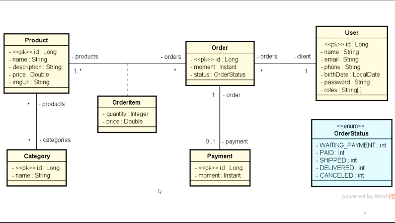
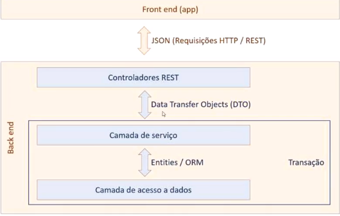

  

# Objetivo

Aprenderemos funcionalidades que a nossa aplicação irá utilizar, por exemplo:

1. CRUD - Seria a tela de cadastro de produtos, onde podemos:
   - Inserir;
   - Atualizar;
   - Deletar;
   - Consultar.

2. As funcionalidades do CRUD serão por meio da web (API via web).

## Requisitos projeto

Todas as premissas e o sumário com o que deve ser feito está no "Documento de Requesitos DSCommerce.pdf".
Como é algo específico do curso, não colocarei o link, mas você pode adquirir no site [devsuperior]().

## UML

## API REST - Conceitos

Primeiramente, precisamos saber o que é uma API. Uma API é um conjunto de funcionalidades que são expostas por uma
aplicação/módulo.

Pode ser considerada também como um **contrato** entre um provedor e um consumidor de funcionalidades.

### API WEB

API disponibilizada via web. Suas funcionalidades são acessadas via endpoints web (o endereço que colocamos no navegador
com aquela "/"), exemplo: host, porta, rota, parâmetros, corpo(payload), de cabeçalhos, **usando um protocolo HTTP**.

### API REST

É uma API Web que está e conformidade com as restrições do padrão REST.

#### Padrão REST - Regras
- Cliente/servidor com HTTP;
  - Uma aplicação frontend pode acessar a API via HTTP, por exemplo.
- Comunicação stateless;
  - Cada requisição será independente e isolada.
- Cache;
  - Armazenar dados em memória para melhor aproveitamento. 
- Interface uniforme, formato padronizado;
  - Rotas (especificações de como acessar a API) padronizado.
- Sistema em camadas;
- Código sob demanda (opcional)

[Veja mais](https://www.redhat.com/pt-br/topics/api/what-is-a-rest-api)

## Recursos, URL, parâmetros de consulta e de rota

As funcionalidades e informações de um sistema web são organizadas na forma de **RECURSOS**.

Cada recurso corresponde a alguma entidade do nosso negócio (ou conjunto de informações), veja, por exemplo, o recurso
Product:

URL - Universal Resource Locator

A URL deve acessar os recursos pelo nome:

- GET:host:port/products - (obtém os produtos)
- GET:host:port/products?page=3 - (obter produtos página 3)
- GET:host:port/products/1 - (obter produto id 1)
- GET:host:port/products1/categories - (obter categorias do produto id 1)

## Padrões de URL, verbos HTTP, códigos de resposta

Quando definimos a nossa rota, ela precisa ter um formato padronizado.

A ação que desejamos fazer deve ser expressa pelo verbo HTTP e não por sua rota.

ERRADO: Não é correto colocar o verbo da ação (insert) na rota

- GET:host:port/insertProduct
- GET:host:port/listProduct

CERTO: Usar os verbos HTPP (post) pra inserir, (get) para obter, etc.

- POST:host:port/products
- GET:host:port/products

### Verbos HTTP mais utilizados

- GET - obter recurso;
- POST - criar novo recurso;
- PUT - salvar recurso de forma idempotente;
- DELETE - deletar recurso

❗Operação idempotente = não causa novos efeitos se executada mais de uma vez.

### Códigos de resposta HTTP

- Respostas de informação (100-199);
- Respostas de sucesso (200-299);
- Redirecionamentos (300-399);
- Erros do cliente (400-499);
- Erros do Servidor (500-599).

## Padrão camadas

Organizando a aplicação em camadas com responsabilidades definidas (uma forma de reestruturar o sistema), deixando o
mesmo em um estado de fácil manutenção.

- Consiste em organizar os **COMPONENTES** do sistema em partes denominadas camadas;

Componentes entenda por SERVICE, ProductService, ClientService, objetos que fazem
funções/operações. Entidades como Produto, Pedido não entram nesse quesito.

- Cada camada possui uma responsabilidade específica;

Na hora de realizar alguma manutenção, trocar qualquer coisa já sabemos onde aquilo estará pois fizemos a devidade
separação das camadas;

- Componentes de uma camada só podem depender de componentes da mesma camada, ou da camada mais abaixo, veja:

Controladores conversam com a camada de Service através de DTO.

Por sua vez, camada de Service conversa com a camada de acesso a dados através de Entidades (Product, Category, User).

Portanto, resumindo a imagem:

1. Na camada de acesso a dados as entidades estarão devidamente mapeadas para conversar com a camada de Service.
2. Para a camada de serviço conversar com a de Controle, as entidades mapeadas serão convertidas em DTO.

TRANSAÇÃO

Tudo que for transação, ou seja, acesso a banco de dados sera resolvido na camada de serviço com acesso a dados.

### Responsabilidades das camadas

- Controlador: responder interações do usuário.

No caso de uma API REST, essas "interações" são as **REQUISIÇÕES**.

- Service: realizar operações de negócio:

Um método da camada Service, deve ter um SIGNIFICADO relacionado ao negócio. Podendo executar várias operações.
Exemplo: registrarPedido, somente este método terá dentro dele: [verificar estoque, salvar pedido, baixar estoque, 
enviar email].

- Repository: realizará operações "individuais" de acesso ao banco de dados.

Métodos findAll, findById, consulta SQL, inserção/atualização/deleção de registros, etc...

## Primeiro teste da API

## Primeiro teste com repository

## Criando DTO e estruturando camadas

## Dica da bilioteca ModelMapper para DTO

## CRUD

## Busca paginada de produtos

## Inserindo novo produto com POST

## Customizando resposta com ResponseEntity

## Atualizando produto com PUT

## Deletando produto com DELETE

## Criando exceções de serviço customizadas

## Implementando outras exceções 

## Validação com Bean Validation

## Customizando a resposta da validação

## DESAFIO CRUD de clientes